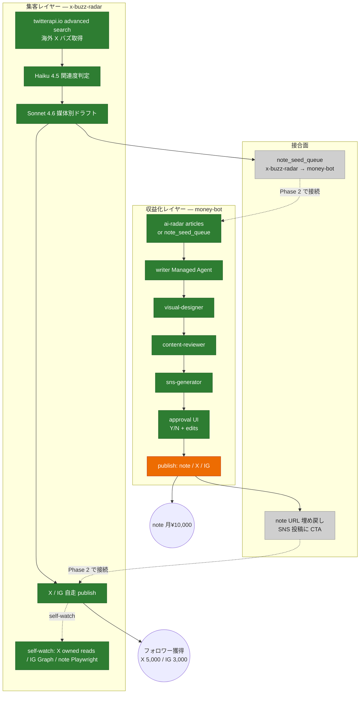
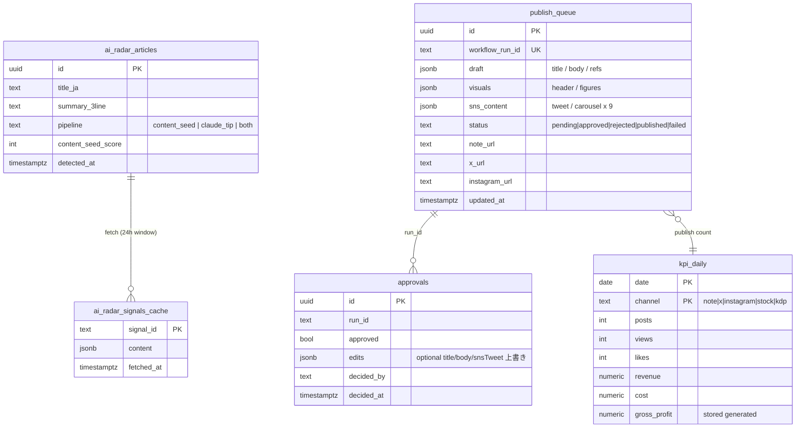
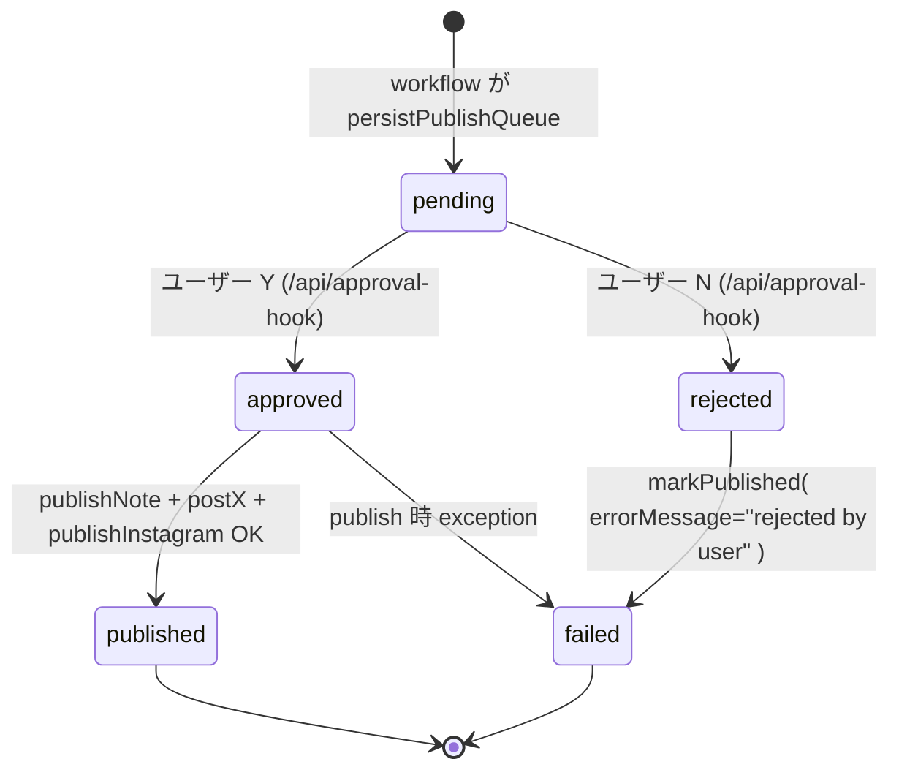
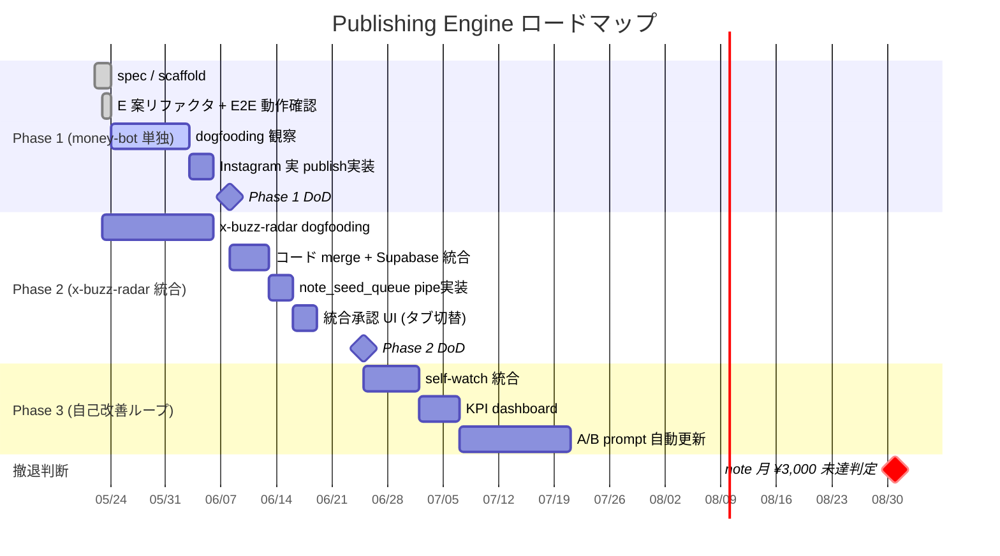
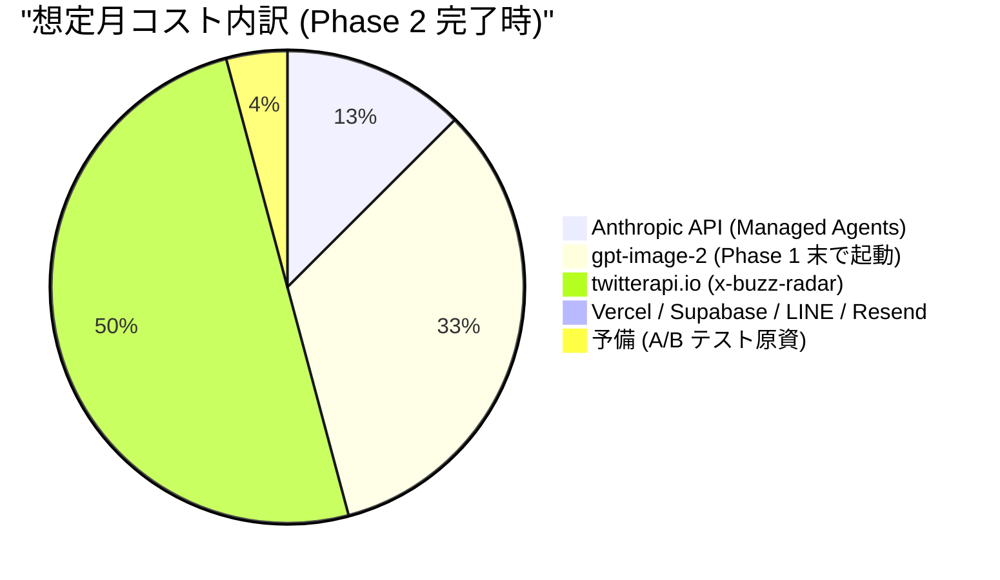

# Publishing Engine 現状可視化 (money-bot + x-buzz-radar)

> Obsidian / GitHub で Mermaid 図として描画されます。

## 1. 戦略の全体像 — 集客 → 収益化 Funnel



**凡例**: 🟢 緑 = 実装/動作確認済 / 🟠 オレンジ = Phase 1 進行中 (一部 mock) / ⚪ 灰 = Phase 2 計画

---

## 2. money-bot Phase 1 — daily-publish workflow フロー

```mermaid
flowchart TB
    classDef done fill:#2e7d32,color:#fff,stroke:#1b5e20
    classDef wip fill:#ed6c02,color:#fff,stroke:#bf360c
    classDef extp fill:#1976d2,color:#fff,stroke:#0d47a1
    classDef ext fill:#9c27b0,color:#fff,stroke:#4a148c

    CR[("cron JST 14:00<br/>= UTC 05:00")]:::ext
    API1["/api/cron/daily-publish<br/>CRON_SECRET 認証"]:::done
    WF["workflow.start( dailyPublishWorkflow )"]:::done

    BG[checkBudgetOrAbort<br/>monthly_budget < spent ?]:::done
    SIG[fetchAiRadarSignals<br/>articles direct read]:::wip
    TOP[selectTopic]:::done

    W[writerAgent<br/>Haiku 4.5]:::done
    V[visualDesignerAgent<br/>Sonnet 4.6]:::done
    R[contentReviewerAgent<br/>Sonnet 4.6]:::done
    S[snsGeneratorAgent<br/>Haiku 4.5]:::done

    PQ[(publish_queue<br/>pending)]:::done
    NL[notifyApprovalReady<br/>LINE push]:::done
    HOOK{defineHook<br/>approval gate<br/>durable wait}:::done

    UI["approval-queue/[runId]<br/>モバイル Web UI"]:::done
    AH["/api/approval-hook<br/>approvalHook.resume( )"]:::done

    PUBN[publishNote<br/>(queued)]:::wip
    PUBX[postX<br/>(queued)]:::wip
    PUBIG[publishInstagram<br/>(Phase 1 mock)]:::wip
    MARK[markPublished]:::done
    KPI[recordKpi × 3 channel]:::done

    AR[("ai-radar.articles<br/>Supabase")]:::extp
    SB[("Supabase<br/>publish_queue<br/>approvals<br/>kpi_daily")]:::extp
    LN[("LINE Messaging API")]:::extp
    MA[("Anthropic Managed Agents<br/>agent x 4 + env x 1")]:::extp

    CR --> API1 --> WF --> BG --> SIG --> TOP
    SIG -.read.-> AR
    TOP --> W --> V --> R --> S --> PQ
    W -.session.-> MA
    V -.session.-> MA
    R -.session.-> MA
    S -.session.-> MA
    PQ -.write.-> SB
    PQ --> NL --> HOOK
    NL -.push.-> LN
    HOOK <-.->|resume| AH
    UI -.fetch publish_queue.-> SB
    LN -.通知.-> UI
    AH -.update approvals/publish_queue.-> SB
    HOOK --> PUBN --> PUBX --> PUBIG --> MARK --> KPI
    PUBIG -.Phase 2 で実装.-> IG[("Instagram Graph API")]
    KPI -.upsert.-> SB
```

---

## 3. 実装進捗マトリクス (Phase 1)

```mermaid
flowchart LR
    classDef done fill:#2e7d32,color:#fff
    classDef wip fill:#ed6c02,color:#fff
    classDef todo fill:#cfcfcf,color:#222
    classDef human fill:#0288d1,color:#fff

    subgraph INF[インフラ]
        I1[Next.js 16 App Router]:::done
        I2[WDK 4.2 + withWorkflow]:::done
        I3[Vercel project link + env 13 件投入]:::done
        I4[Supabase migration 0001 apply]:::done
        I5[Managed Agents agent x 4 + env x 1 作成]:::done
        I6[production deploy READY]:::done
    end

    subgraph CORE[コアロジック]
        C1[lib/managed-agents.ts<br/>session helper]:::done
        C2[lib/agents.ts<br/>4 wrapper + zod 安全パース]:::done
        C3[workflows/prompts/*.ts<br/>4 system prompt]:::done
        C4[workflows/daily-publish.ts<br/>9 step durable chain]:::done
        C5[lib/notify.ts<br/>LINE messagingApi v11]:::done
        C6[lib/budget.ts<br/>kpi + budget guard]:::done
        C7[lib/publishers.ts<br/>queue + IG mock]:::wip
        C8[lib/ai-radar.ts<br/>articles read]:::wip
    end

    subgraph UI[UI]
        U1[app/layout.tsx + globals.css]:::done
        U2[/api/cron/daily-publish]:::done
        U3[/api/approval-hook]:::done
        U4[/api/line-webhook]:::done
        U5[/approval-queue/&#91;runId&#93;]:::done
    end

    subgraph E2E[E2E 動作確認]
        E1[cron trigger HTTP 200]:::done
        E2[writer/visual/reviewer/sns 全成功]:::done
        E3[LINE 承認通知到達]:::done
        E4[承認 UI Y/N 反映]:::done
        E5[publish_queue status 更新]:::done
        E6[翌日 JST 14:00 自走確認]:::todo
        E7[Instagram 実 publish]:::todo
    end

    subgraph H[人間タスク (完了済)]
        H1[Supabase project 確認]:::human
        H2[LINE Messaging API channel]:::human
        H3[Instagram Graph API token]:::human
        H4[Vercel project + env 投入]:::human
        H5[bot 友だち追加 + userId capture]:::human
    end
```

**進捗サマリ**:
- ✅ **30 / 32 項目完了** (94%)
- ⏳ **残 2**: 翌日 cron 自走観察 / Instagram 実 publish (Phase 1 末)
- 🔵 人間タスク **5/5 完了**

---

## 4. データフロー (Supabase)



---

## 5. workflow 状態遷移 (publish_queue)



**今日の dogfooding 結果**:
- `run_1779531721265_q07wpd` → `rejected` (rubric F、Phase 1 早期 return バグ前)
- `run_1779532797470_rcd5h3` → `failed` (LINE 承認 UI で N 押下 = rejected by user。Phase 1 dogfooding flow 正常動作確認)

---

## 6. タイムライン (Phase 1 → 2 → 3)



---

## 7. 月予算と運用コスト (実測 + 試算)



**合計試算 ~¥12,000/月** (spec の ¥10,000 + 約 20% over → x-buzz-radar 統合で twitterapi.io 分が乗るため)。  
strict 化したい場合は kill switch (`MONEY_BOT_KILL_SWITCH=1`) で即停止可能。

---

## 8. 関連ドキュメント

- 親 spec: [money-bot](2026-05-22-money-bot-design.md) / [x-buzz-radar](2026-05-23-x-buzz-radar-design.md) / [統合設計](2026-05-23-publishing-engine-integration-design.md)
- 振り返り raw: [E2E デバッグログ](../../../raw/facts/situations/2026-05-23-money-bot-e2e-debug-log.md) / [統合判断](../../../raw/facts/situations/2026-05-23-money-bot-x-buzz-radar-integration-decision.md)
- メモリ: `project_money_bot` / `project_x_buzz_radar` / `feedback_external_sdk_deploy_constraint_precheck`
